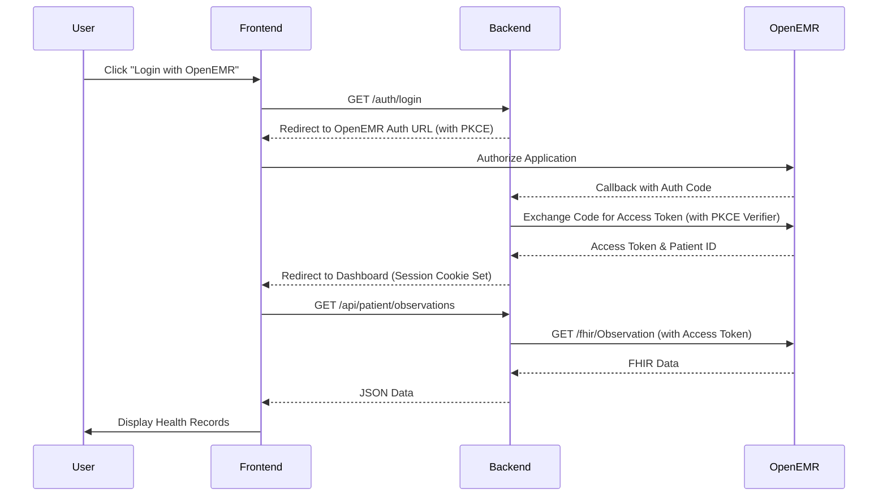

# OpenEMR SMART on FHIR Integration

This project demonstrates a comprehensive integration with OpenEMR using the SMART on FHIR standalone launch flow. It consists of a React-based frontend and a Node.js/Express backend that handles OAuth 2.0 authentication with PKCE and proxies FHIR API requests.

## Project Overview

The goal of this project is to provide a secure and user-friendly portal for patients to access their health records from OpenEMR. The integration follows the SMART on FHIR standards to ensure interoperability and security.

## Architecture

The application follows a decoupled architecture:
- **Frontend**: A React application built with TypeScript and Vite. It handles the user interface, state management, and communicates with the backend API.
- **Backend**: A Node.js Express server that manages the OAuth 2.0 flow, session handling, and acts as a secure proxy for OpenEMR's FHIR API.

## EHR Integration Steps

### 1. OpenEMR Setup
- **Register OAuth Client**: In OpenEMR, navigate to the Client Registration section and create a new client.
- **Redirect URI**: Set the redirect URI to `http://localhost:3001/auth/callback` (or your backend's callback endpoint).
- **Scopes**: Ensure the client has access to the necessary FHIR scopes (e.g., `openid`, `fhirUser`, `launch/patient`, `patient/*.read`).

### 2. SMART on FHIR Standalone Launch
The application implements the Standalone Launch flow:
1.  **Discovery**: The backend is configured with OpenEMR's FHIR base URL and OAuth endpoints.
2.  **Authorization**: The user is redirected to OpenEMR to log in and authorize the app.
3.  **Token Exchange**: The backend exchanges the authorization code for an access token using PKCE (Proof Key for Code Exchange) for enhanced security.
4.  **Patient Context**: The access token response includes the `patient` ID, which is used to scope all subsequent FHIR requests.

## Key Features

### Backend
- **OAuth 2.0 with PKCE**: Secure authentication without exposing secrets on the frontend.
- **Session Management**: Uses secure, HTTP-only cookies to maintain user sessions.
- **FHIR API Proxy**: Simplifies frontend requests and handles token injection.
- **Automatic Token Refresh**: Ensures uninterrupted access by refreshing tokens before they expire.

### Frontend
- **Patient Dashboard**: A unified view of the patient's health status.
- **Detailed Records**: Dedicated pages for:
    - **Observations**: Lab results and vital signs with trend visualization.
    - **Conditions**: Active and past diagnoses.
    - **Medications**: Current prescriptions and dosage info.
    - **Allergies**: Known sensitivities and reactions.
    - **Appointments**: Upcoming and past clinical visits.
- **Auth Context**: Centralized authentication state management.

## Setup and Installation

### Prerequisites
- Node.js (v18 or higher)
- OpenEMR instance (accessible via network)
- Docker (optional, for containerized deployment)

### Backend Setup
1. Navigate to the `backend` directory.
2. Install dependencies: `npm install`.
3. Create a `.env` file based on `.env.example` and fill in your OpenEMR credentials and OAuth client ID.
4. Start the server: `npm run dev`.

### Frontend Setup
1. Navigate to the `frontend` directory.
2. Install dependencies: `npm install`.
3. Start the development server: `npm run dev`.

## Environment Variables

### Backend (`backend/.env`)
- `PORT`: Server port (default: 3001)
- `OAUTH_CLIENT_ID`: Your OpenEMR OAuth client ID
- `OAUTH_CLIENT_SECRET`: Your OpenEMR OAuth client secret (if applicable)
- `OPENEMR_URL`: Base URL of your OpenEMR instance
- `SESSION_SECRET`: A secure string for session encryption
- `FRONTEND_URL`: URL of your frontend application

## Usage Flow

1. Open the frontend application in your browser.
2. Click the **"Login with OpenEMR"** button.
3. You will be redirected to the OpenEMR login page.
4. Enter your OpenEMR credentials and authorize the application.
5. Upon successful authorization, you will be redirected back to the dashboard.
6. Explore your medical records using the navigation menu.

## Security Considerations
- **PKCE**: Used to prevent authorization code injection attacks.
- **HTTP-only Cookies**: Protects session tokens from XSS attacks.
- **CORS**: Configured to only allow requests from the trusted frontend origin.
- **Server-side Token Storage**: Access tokens are never exposed to the browser.
